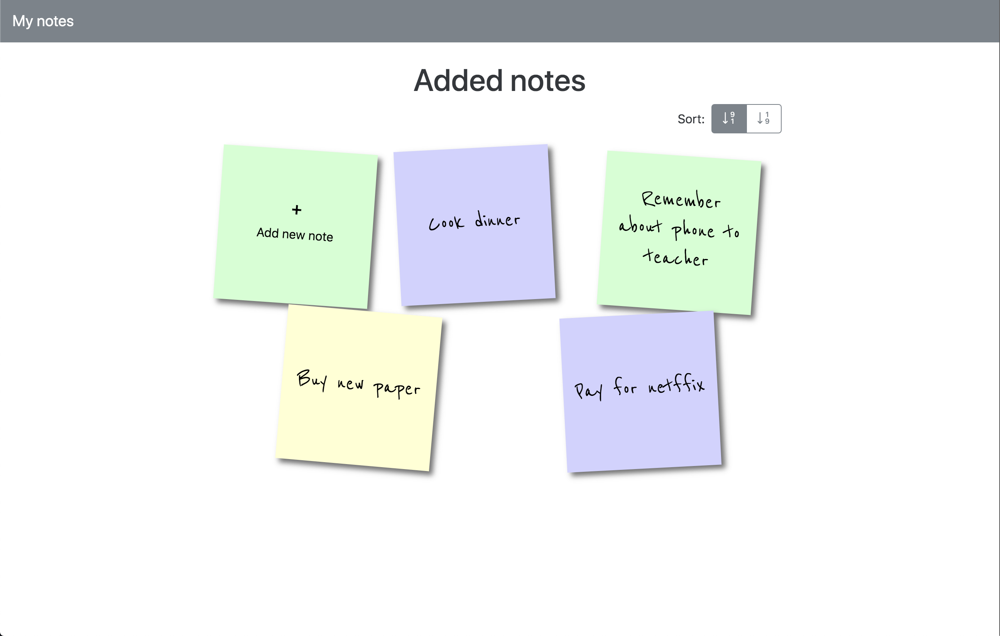

# my-notes

Simple CRUD app. You can create note, read note details, update and delete note.
You need add file `.env` with `API_URL` form https://crudcrud.com/ API

file `.env` can looks:

```
API_URL=https://crudcrud.com/api/006daaa40906430491f438a0db39c5a6
```

Example added notes:



## Build Setup

```bash
# install dependencies
$ npm install

# serve with hot reload at localhost:3000
$ npm run dev

# build for production and launch server
$ npm run build
$ npm run start

# generate static project
$ npm run generate
```

For detailed explanation on how things work, check out [Nuxt.js docs](https://nuxtjs.org).
